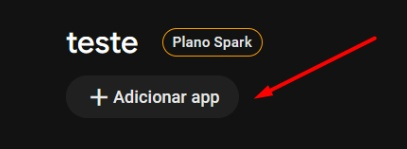

# Firebase Push Notifications for Flutter

Tutorial de como adicionar notificações push num projeto Flutter.

## Criando projeto no FIREBASE

Clique em **Adicionar app**:



Selecione **Flutter**:


## No projeto Flutter

Certifique que seu arquivo pubspec.yaml contem os pacotes do firebase `firebase_messaging` e `firebase_core`.

Se sim, execute:

```bash
> dart pub global activate flutterfire_cli
```

```bat
> firebase login
```

Para selecionar o projeto e as plataformas:

```bat
> flutterfire configure 
```

### Inicializar Firebase

No arquivo main (ou nas dependencias iniciais do projeto), coloque o código:

```dart
await Firebase.initializeApp(
    options: DefaultFirebaseOptions.currentPlatform,
);
```
